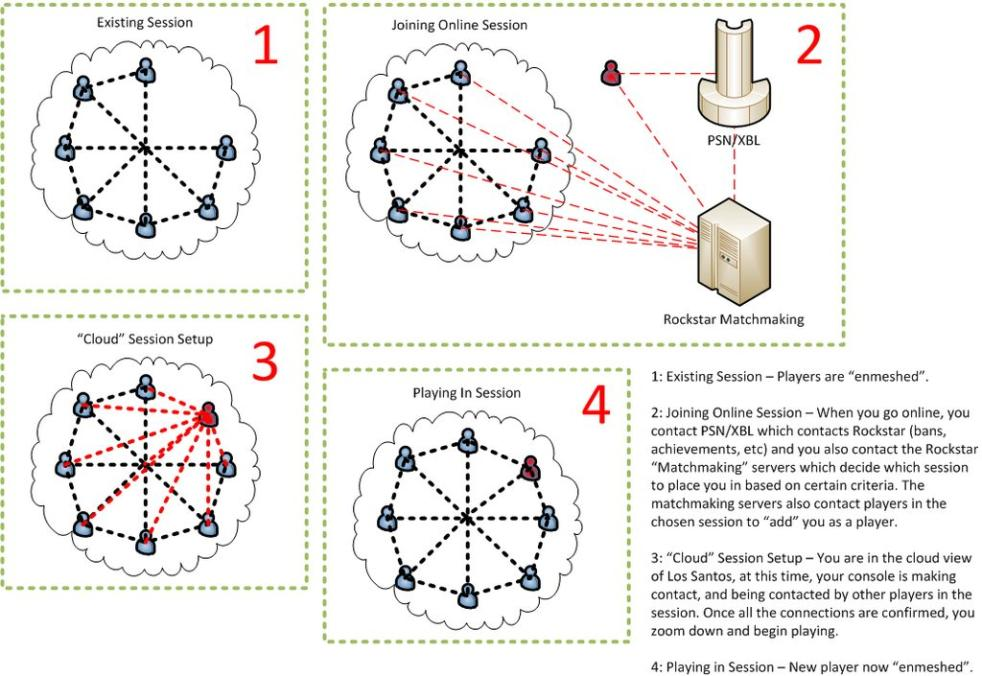

[Türkçe](README.md) | [English](README_EN.md)

# Problem
Çoğu Twitch yayıncısı ve GTA:V Online oyuncularının hackerlar tarafından sürekli oyundan atılmaları veya sürekli lobilerine saldırıp yayın ve oyun zevkini sıfıra indiren hackerler.

# Çözüm

Öncelike GTA:V Online nasıl çalışıyor bunu öğrenmeliyiz. 

## GTA:V Online nasıl çalışıyor?

 
 
Özet geçmek gerekirse bir lobiye bağlanmak istediğinizde Rockstar'a ait matchmaking (karşılaştırma) sunucularından size uygun olan lobilerin bilgileri tarafınıza iletilir. Bu lobilerden bir tanesine bağlanma isteği atar ve ardından bağlantı kurulabiliyorsa sizi oyuna dahil eder.

Burada dikkat etmemiz gereken konu Rockstar bu işlemler sırasında lobiler üzerinde herhangi bir güvenlik kontrolü yapmıyor. Yaptığı kontroller sadece sizin bilgilerinizi alıp online ve offline statülerinizi saklamakla ve kontrol etmekle alakalı.

Özel lobiler karşılaştırma sunucularında sadece "Özel" olarak işaretleniyor dolayısıyla bu lobilerin üstünde de kontrol yapılmıyor. 

Oyun lobilerine dahil olma işlemi tamamen kullanıcı arayüzünde engelleniyor bu kontrol Rockstar tarafından yapılmıyor. 

Hile kullanıcıları sizi kullanıcı adınızdan bulup Rockstar servislerine direkt bağlantı isteği gönderip bu arayüz engeleni aşarak bağlanıyorlar. Aslında problem burada başlıyor.

GTA:V Online için Rockstar'ın lobi bilgilerini ya da kullanıcı bilgilerini tuttuğu sunucular haricinde herhangi bir sunucuya bağlanmıyor. Bütün oyun trafiği (Peer-to-Peer) kullanıcılar üzerinden birbirlerine aktarılıyor.

Aslında bütün bu anlattıklarımı görev yöneticisinde kaynak izleyicisini kullanarak sizlerde görebilirsiniz.

## Hilelerin oyunumuza girmesini nasıl engelleriz?

Peer-to-Peer destekleyen oyunlarda (bunu LAN üzerinden oyun oynamaya da benzetebilirsiniz, sadece daha geniş bir ağ içerisindesiniz) eğer istekler bir sunucu tarafından filtrelenmiyorsa ve karar merkezi X bir kullanıcı ise VPN kullanarak bu durumu aşabiliriz.

VPN'i burada arkadaşlarımızla kendimiz arasında özel bir ağ kurmak için kullanıyoruz (Hamachi gibi düşünebilirsiniz). 

Burada dikkat etmemiz gereken konu, oyun trafiği haricinde hiç bir trafiğin VPN üzerinden geçmemesi. Böylece Twitch yayıncıları yayın yaparken problem yaşamayacaklar.

## Kurulum
Bu adımları uygulamak için bir sunucuya sahip olmalısınız.

Öncelikle sunucumuza wireguard kurulumu yapmalıyız.

```bash
curl -O https://raw.githubusercontent.com/angristan/wireguard-install/master/wireguard-install.sh
chmod +x wireguard-install.sh
./wireguard-install.sh
```

`/etc/wireguard/wg0.conf` dosyasında `PostUp` parametresine wireguard başlarken çalışacak `ip link set wg0 multicast on` komutunu ekliyoruz. 

### Örnek:

```
PostUp = ip link set wg0 multicast on; iptables -A FORWARD -i ens3 -o wg0 -j ACCEPT; iptables -A FORWARD -i wg0 -j AC...
```

Wireguard kurulumunu tamamladıktan sonra sunucumuzda `iptables` a gerekli kuralları ekleyip oyunun portlarına VPN harici gelebilecek trafikler için kapatıp, VPN içerisinde açık bir hale getiriyoruz.

not: Aşağıdaki kurallarda `ens3` size göre değişiklik gösterebilir (Ethernet kartını temsil eder). `ifconfig` komutu ile kendi ethernet kartınızı öğrenebilirsiniz.

```
iptables -I INPUT -p udp -m udp --dport 6672 -j DROP
iptables -I INPUT -p udp -m udp --sport 6672 -j DROP
iptables -I OUTPUT -p udp -m udp --dport 6672 -j DROP
iptables -I OUTPUT -p udp -m udp --sport 6672 -j DROP
iptables -I FORWARD -i wg0 -j ACCEPT
iptables -I FORWARD -i ens3 -o wg0 -j ACCEPT
iptables -I FORWARD -i wg0 -o wg0 -j ACCEPT
iptables -I FORWARD -i ens3 -p udp -m udp --sport 6672 -j DROP
iptables -I FORWARD -i ens3 -p udp -m udp --dport 6672 -j DROP
```

Bu kuralları ekledikten sonra sunucumuzu yeniden başlatıp, VPN servisimizi hazır bir hale getiriyoruz.

Sunucuyu restart ettikten sonra artık wireguard kullanıcı konfigürasyon dosyalarını oluşturabiliriz bunun için `wireguard-install.sh` dosyasını çalıştırıp adımları izlemeniz yeterli

Son olarak oluşturmuş olduğunuz konfigürasyon dosyalarında ki `AllowedIPs` parametresine aşağıdaki ip adreslerini eklemeniz gerekiyor. `Rockstar`, `Microsoft Azure` sunucularını kullandığı ve Matchmaking sunucularının ip adresleri belli olmadığı için maalesef tüm Azure ip bloğunu eklemek zorundayız.

not: Bu ip aralıklarından OneDrive gibi uygulamalar etkilenebilir.

```
AllowedIPs = 10.66.66.0/24, 239.255.255.250/32, 192.81.240.0/21, 192.81.242.0/24, 104.255.104.0/22, 67.22.221.0/24, 67.22.222.0/24, 67.22.223.0/24, 192.81.240.0/21, 104.255.104.0/22, 52.96.38.0/24, 20.37.64.0/19, 20.45.64.0/20, 20.45.80.0/24, 20.46.32.0/24, 40.66.166.0/24, 40.95.238.0/23, 40.107.142.0/23, 40.123.192.0/19, 40.126.192.0/23, 52.105.196.0/23, 52.96.0.0/14, 104.47.19.0/24, 20.45.128.0/20, 40.107.18.0/23, 40.95.86.0/23, 52.98.16.0/22, 102.37.0.0/16, 128.94.0.0/16, 135.149.0.0/16, 138.239.0.0/16, 147.145.0.0/16, 148.7.0.0/16, 155.62.0.0/16, 158.158.0.0/16, 167.105.0.0/16, 169.138.0.0/16, 170.165.0.0/16, 23.103.160.0/20, 40.104.0.0/15, 198.180.97.0/24, 192.100.104.0/21, 192.100.112.0/21, 192.100.120.0/21, 192.100.128.0/22, 194.41.16.0/20, 20.135.0.0/16, 20.143.0.0/16, 20.152.0.0/16, 20.153.0.0/16, 20.157.0.0/16, 20.33.0.0/16, 102.37.0.0/17, 102.37.128.0/17, 208.68.136.0/21, 131.253.8.0/24, 131.253.1.0/24, 204.95.96.0/20, 168.61.0.0/16, 51.116.0.0/16, 51.104.0.0/15, 204.79.252.0/24, 199.74.210.0/24, 206.191.224.0/19, 51.136.0.0/15, 206.138.168.0/21, 192.197.157.0/24, 64.4.0.0/18, 51.51.0.0/16, 51.107.0.0/16, 216.32.180.0/22, 198.206.164.0/24, 199.60.28.0/24, 23.103.128.0/17, 131.253.61.0/24, 213.199.128.0/18, 138.91.0.0/16, 168.62.0.0/15, 51.10.0.0/15, 207.68.128.0/18, 23.96.0.0/14, 216.220.208.0/20, 193.221.113.0/24, 70.37.128.0/18, 13.64.0.0/11, 13.104.0.0/14, 131.253.6.0/24, 65.52.0.0/14, 51.124.0.0/16, 192.84.159.0/24, 193.149.64.0/19, 198.49.8.0/24, 131.253.5.0/24, 51.120.0.0/16, 131.253.24.0/21, 66.119.144.0/20, 51.140.0.0/14, 198.200.130.0/24, 204.152.140.0/23, 192.48.225.0/24, 51.132.0.0/16, 199.242.32.0/20, 51.103.0.0/16, 202.89.224.0/21, 51.53.0.0/16, 23.100.0.0/15, 94.245.64.0/18, 209.240.192.0/19, 131.253.62.0/23, 51.12.0.0/15, 134.170.0.0/16, 51.144.0.0/15, 131.253.12.0/22, 137.135.0.0/16, 199.30.16.0/20, 199.242.48.0/21, 199.103.90.0/23, 191.232.0.0/13, 104.40.0.0/13, 104.208.0.0/13, 199.103.122.0/24, 104.146.128.0/17, 131.253.32.0/20, 23.102.0.0/16, 132.245.0.0/16, 51.138.0.0/16, 23.103.64.0/18, 131.253.128.0/17, 40.64.0.0/15, 40.66.0.0/17, 40.67.0.0/16, 40.68.0.0/14, 40.74.0.0/15, 40.76.0.0/14, 40.80.0.0/12, 40.104.0.0/14, 40.108.128.0/17, 40.110.0.0/15, 40.112.0.0/13, 40.120.0.0/14, 40.124.0.0/16, 40.125.0.0/17, 40.126.0.0/18, 40.126.128.0/17, 40.127.0.0/16, 72.144.0.0/14, 72.152.0.0/14, 74.160.0.0/14, 74.176.0.0/14, 74.224.0.0/14, 74.240.0.0/14, 98.64.0.0/14, 108.140.0.0/14, 68.154.0.0/15, 68.210.0.0/15, 68.218.0.0/15, 68.220.0.0/15, 70.156.0.0/15, 74.234.0.0/15, 74.248.0.0/15, 98.70.0.0/15, 20.46.192.0/19, 20.46.144.0/20, 40.120.0.0/20, 40.119.160.0/19, 70.37.0.0/17, 204.79.179.0/24, 207.46.40.0/21, 208.76.46.0/24, 13.107.14.0/24, 20.0.0.0/11, 207.46.128.0/17, 204.79.135.0/24, 207.46.0.0/19, 199.103.90.0/24, 207.46.36.0/22, 207.46.48.0/20, 204.79.195.0/24, 208.76.45.0/24, 209.185.240.0/24, 209.185.240.0/23, 207.46.64.0/18, 52.96.0.0/12, 20.160.0.0/12, 52.148.0.0/14, 52.125.0.0/16, 52.146.0.0/15, 52.112.0.0/14, 111.221.64.0/18, 52.224.0.0/11, 150.171.0.0/24, 20.36.0.0/14, 52.160.0.0/11, 102.133.0.0/16, 52.152.0.0/13, 52.136.0.0/13, 20.184.0.0/13, 20.150.0.0/15, 150.171.254.0/24, 52.120.0.0/14, 150.171.0.0/16, 20.40.0.0/13, 102.133.0.0/17, 102.133.128.0/17, 157.56.0.0/16, 20.192.0.0/10, 20.48.0.0/12, 20.64.0.0/10, 157.55.0.0/16, 40.127.0.0/19, 40.96.0.0/13, 147.243.0.0/16, 111.221.16.0/21, 111.221.24.0/22, 111.221.29.0/24, 111.221.30.0/23, 20.46.32.0/19, 137.116.0.0/16, 137.117.0.0/16, 192.84.161.0/24, 192.84.160.0/24, 40.123.224.0/20, 204.140.80.0/24, 91.225.248.0/24, 198.180.95.0/24, 52.239.232.0/24, 4.144.0.0/12, 4.160.0.0/12, 4.176.0.0/12, 4.192.0.0/12, 4.208.0.0/12, 4.224.0.0/12, 4.240.0.0/12, 20.74.128.0/17, 20.196.0.0/18, 20.203.0.0/17, 20.45.64.0/19, 40.72.255.0/24, 204.231.194.0/24, 170.114.39.0/24, 194.41.20.0/24, 199.65.28.0/24, 212.46.57.0/24, 198.8.73.0/24, 20.136.0.0/17, 72.18.78.0/24, 192.40.79.0/24, 185.209.208.0/24, 142.0.188.0/24, 74.200.130.0/24, 103.249.62.0/24, 185.209.209.0/24, 178.255.242.0/24, 195.114.140.0/24, 204.14.180.0/22, 208.84.0.0/21, 91.216.184.0/24, 62.12.56.0/24, 62.12.57.0/24, 62.12.59.0/24, 62.12.58.0/24, 103.249.63.0/24, 62.12.61.0/24, 208.80.20.0/24, 78.25.1.0/24, 185.154.80.0/24, 185.154.81.0/24, 185.154.82.0/24, 185.154.83.0/24, 195.105.26.0/24, 62.12.60.0/24, 212.1.223.0/24, 212.1.222.0/24, 198.47.13.0/24, 113.197.65.0/24, 185.195.244.0/24, 66.178.148.0/24, 40.162.0.0/16, 70.152.0.0/15, 132.164.0.0/16, 135.130.0.0/16, 138.105.0.0/16, 158.23.0.0/16, 159.128.0.0/16, 157.31.0.0/16, 172.160.0.0/11, 172.200.0.0/13, 172.208.0.0/13, 208.80.21.0/24, 113.197.67.0/24, 74.80.229.0/24, 69.84.180.0/24, 185.195.245.0/24, 50.114.38.0/24, 212.1.218.0/24, 212.1.219.0/24, 208.66.228.0/24, 203.84.135.0/24, 185.236.126.0/24, 66.178.149.0/24, 198.51.0.0/24, 194.41.21.0/24, 194.41.19.0/24, 213.199.128.0/18, 51.51.0.0/16, 192.100.112.0/21, 192.100.120.0/21, 94.245.64.0/18, 51.10.0.0/15, 51.103.0.0/16, 51.104.0.0/15, 51.107.0.0/16, 51.116.0.0/16, 51.12.0.0/15, 51.120.0.0/16, 51.124.0.0/16, 51.132.0.0/16, 51.136.0.0/15, 51.138.0.0/16, 51.140.0.0/14, 51.144.0.0/15, 51.53.0.0/16, 147.243.0.0/16, 193.149.64.0/19, 192.100.104.0/21, 192.100.128.0/22, 91.225.248.0/24, 185.236.124.0/24, 91.225.249.0/24, 212.46.57.0/24, 185.209.208.0/24, 185.209.209.0/24, 195.105.26.0/24, 195.105.27.0/24, 195.114.140.0/24, 185.154.81.0/24, 185.154.82.0/24, 185.154.83.0/24, 185.154.80.0/24, 192.40.79.0/24, 132.164.0.0/16, 135.130.0.0/16, 138.105.0.0/16, 159.128.0.0/16, 157.31.0.0/16, 172.160.0.0/11, 172.200.0.0/13, 172.208.0.0/13, 128.94.0.0/16, 135.149.0.0/16, 138.239.0.0/16, 147.145.0.0/16, 148.7.0.0/16, 155.62.0.0/16, 158.158.0.0/16, 167.105.0.0/16, 169.138.0.0/16, 170.165.0.0/16, 111.221.16.0/21, 111.221.24.0/22, 111.221.29.0/24, 111.221.30.0/23, 167.220.240.0/22, 167.220.240.0/23, 167.220.240.0/24, 167.220.241.0/24, 167.220.242.0/23, 167.220.242.0/24, 167.220.243.0/24, 111.221.64.0/19, 111.221.64.0/20, 111.221.64.0/21, 111.221.64.0/22, 111.221.64.0/23, 111.221.64.0/24, 111.221.65.0/24, 111.221.66.0/23, 111.221.66.0/24, 111.221.67.0/24, 111.221.68.0/22, 111.221.68.0/23, 111.221.68.0/24, 111.221.69.0/24, 111.221.70.0/23, 111.221.70.0/24, 111.221.71.0/24, 111.221.72.0/21, 111.221.72.0/22, 111.221.72.0/23, 111.221.72.0/24, 111.221.73.0/24, 111.221.74.0/23, 111.221.74.0/24, 111.221.75.0/24, 111.221.76.0/22, 111.221.76.0/23, 111.221.76.0/24, 111.221.77.0/24, 111.221.78.0/23, 111.221.78.0/24, 111.221.79.0/24, 111.221.80.0/20, 111.221.80.0/21, 202.89.224.0/21, 111.221.80.0/22, 202.89.224.0/22, 111.221.80.0/23, 111.221.80.0/24, 202.89.224.0/23, 202.89.224.0/24, 111.221.81.0/24, 202.89.225.0/24, 111.221.82.0/23, 202.89.226.0/23, 111.221.82.0/24, 111.221.83.0/24, 111.221.84.0/22, 202.89.226.0/24, 202.89.227.0/24, 111.221.84.0/23, 111.221.84.0/24, 202.89.228.0/22, 111.221.85.0/24, 202.89.228.0/23, 111.221.86.0/23, 111.221.86.0/24, 111.221.87.0/24, 202.89.228.0/24, 111.221.88.0/21, 202.89.229.0/24, 202.89.230.0/23, 111.221.88.0/22, 202.89.230.0/24, 111.221.88.0/23, 111.221.88.0/24, 202.89.231.0/24, 111.221.89.0/24, 111.221.90.0/23, 111.221.90.0/24, 111.221.91.0/24, 111.221.92.0/22, 111.221.92.0/23, 111.221.92.0/24, 111.221.93.0/24, 111.221.94.0/23, 111.221.94.0/24, 111.221.95.0/24, 111.221.96.0/19, 111.221.96.0/20, 111.221.96.0/21, 111.221.96.0/22, 111.221.96.0/23, 111.221.96.0/24, 111.221.97.0/24, 111.221.98.0/23, 111.221.98.0/24, 111.221.99.0/24, 111.221.100.0/22, 111.221.100.0/23, 111.221.100.0/24, 111.221.101.0/24, 111.221.102.0/23, 111.221.102.0/24, 111.221.103.0/24, 111.221.104.0/21, 111.221.104.0/22, 111.221.104.0/23, 111.221.104.0/24, 111.221.105.0/24, 111.221.106.0/23, 111.221.106.0/24, 111.221.107.0/24, 111.221.108.0/22, 111.221.108.0/23, 111.221.108.0/24, 111.221.109.0/24, 111.221.110.0/23, 111.221.110.0/24, 111.221.111.0/24, 111.221.112.0/20, 111.221.112.0/21, 111.221.112.0/22, 111.221.112.0/23, 111.221.112.0/24, 111.221.113.0/24, 111.221.114.0/23, 111.221.114.0/24, 111.221.115.0/24, 111.221.116.0/22, 111.221.116.0/23, 111.221.116.0/24, 111.221.117.0/24, 111.221.118.0/23, 111.221.118.0/24, 111.221.119.0/24, 111.221.120.0/21, 111.221.120.0/22, 111.221.120.0/23, 111.221.120.0/24, 111.221.121.0/24, 111.221.122.0/23, 111.221.122.0/24, 111.221.123.0/24, 111.221.124.0/22, 111.221.124.0/23, 111.221.124.0/24, 111.221.125.0/24, 111.221.126.0/23, 111.221.126.0/24, 111.221.127.0/24, 113.197.67.0/24, 158.23.0.0/16, 103.249.62.0/24, 103.249.63.0/24, 113.197.65.0/24, 40.162.0.0/16, 203.84.135.0/24, 203.84.134.0/24
```

Artık konfigürasyon dosyamız hazır. Bunu kendi bilgisayarımızda çalıştırabiliriz. Oyuna bağlandığımızda bizi hiç bir oturuma bağlayamadığından size ait özel bir lobiye dahil edecektir. Artık hile kullanıcıları lobinize gelip sizi rahatsız edemez.

Her kullanıcı için özel bir konfigürasyon dosyası oluşturulmalıdır.

BenKF (Kadir FIRAT) & edminkardes (Görkem GÜN)

Bizleri desteklemek isterseniz;

USDT (TRC20)
TVJFXkb7UUphf4z73jomcTUiANptdz1mJM

ETH (ERC20)
0x03458edd20d98cef50f68ae6d2e857d79584a988
